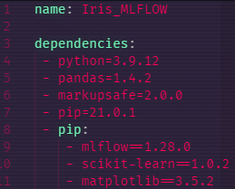
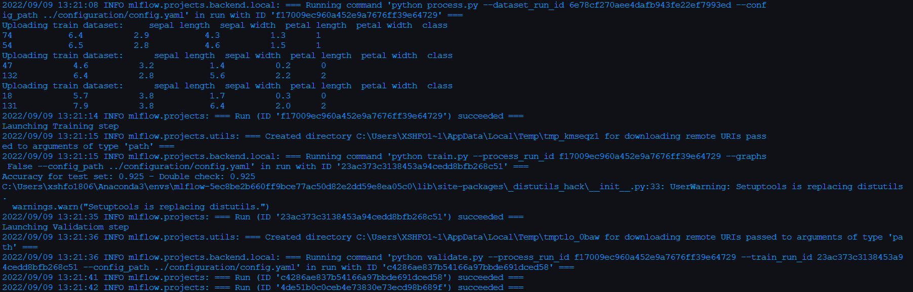
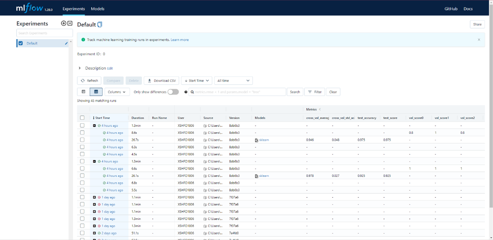

# **Iris MLFlow Classification**

This project is a **Classification model** using the **Iris Dataset**. The model used is a **DecisionTree** and we use MLFlow to manage the Machine Learning life cycle.

The project is run locally and will therefore use storage on your computer

## Table of Contents

- [**Iris MLFlow Classification**](#iris-mlflow-classification)
  - [Table of Contents](#table-of-contents)
  - [Dependencies](#dependencies)
  - [The libraries used are](#the-libraries-used-are)
  - [Setup](#setup)
    - [Installation](#installation)
    - [Removing the Conda Environment](#removing-the-conda-environment)
  - [Project usage](#project-usage)
    - [Running the project](#running-the-project)
      - [Configuration](#configuration)
      - [MLFlow configuration](#mlflow-configuration)
      - [MLFlow pipeline usage](#mlflow-pipeline-usage)
      - [MLFlow UI (User Interface)](#mlflow-ui-user-interface)
      - [Model Serving](#model-serving)
      - [Model prediction](#model-prediction)
        - [1: CURL in Console/Terminal](#1-curl-in-consoleterminal)
        - [2: Postman](#2-postman)
  - [Dataset](#dataset)
  - [Credits](#credits)
  - [Sources](#sources)

## Dependencies

- *Python 3.9.12*
- *Pip 21.0.1*

## The libraries used are

- *MLFlow 1.28.0*
- *Requests*
- *Pathlib*
- *Pandas 1.4.2*
- *SKlearn 1.0.2*
- *Yaml*
- *Click*
- *JSON*

## Setup

### Installation

To run this project you should create a **Conda Environment** (<https://www.anaconda.com/products/distribution>) to run it on. This will help with making sure it can run in it's default configuration

The **Conda Environment** file `Iris-Pipeline/configuration/env.yaml` makes it easy to create the environment to run this project.

Here is an overview of how the environment file looks:



To create the environment, you should type the command in console:

```console
conda env create -f Iris-Pipeline/configuration/env.yaml
```

After having created the environment you also have to activate it:

```console
conda activate Iris_MLFLOW
```

### Removing the Conda Environment

To delete the conda environment you will first have to run a specific command:

´´´
conda env remove -n Iris_MLFLOW
´´´

Afterwards you have to locate where the environment folder is. By default it is under: `C:\Users\YourUserHere\Anaconda3\envs`

You can then delete the folder that matches the name of the Environment files configured name, by default it's name would be: `Iris_MLFLOW`

## Project usage

This project is a Machine Learning Pipeline managed using MLFlow, the pipeline itself is also run using MLFlow

### Running the project

**Note:** *The commands below were run in an Anaconda prompt but can be run in a terminal / console just fine.*

#### Configuration

There is an included config.yaml file under the configuration folder. This file is where you would change different variables easily. Example:

```yaml
features: 
  sepal length: {min: 4.3, max: 7.9}
  sepal width: {min: 2, max: 4.4}
  petal length: {min: 1, max: 6.9}
  petal width: {min: 0.1, max: 2.5}
```

The configuration file is very important for keeping the code clean and avoiding the hardcoding of variables

#### MLFlow configuration

The mlflow configuration is split up in the following steps:

- **Ingest**: Checks if the dataset already exists, if it doesn't then the dataset is downloaded
- **Process**: Data processing step that does a number of data transformations, namely encoding the label column and splitting the dataset from ingest step into 3 different datasets. Train, test and validate.
- **Training**: Trains the DecisionTreeClassifier Model and makes sure it is training with the best configuration
- **Validate**: Validates that the training is done in a way that works well on new and unknown data

#### MLFlow pipeline usage

To use the pipeline you should run the following command:

```mlflow
mlflow run iris-pipeline
```

This runs the iris pipeline fully. You will see a lot of information about the progress of the so-called run, things like which step is running now and what parameters was passed through.

Here is an example of the information you will get when running the pipeline:



It is entirely possible to just run the pipeline and walk away while it's doing it's thing. The things you'd want to check are all available by following the next step.

#### MLFlow UI (User Interface)

The mlflow UI is an interface that can be used to check pipeline runs and see what was written down during each run, along with the model that was saved.

A good pipeline has a lot of information to gather from this interface. Things like the accuracy on different datasets (in this case validation and test accuracy and score)

Here is an example of how the interface looks:



#### Model Serving

To start predicting on the deployed model created from this pipeline, you'll have to first serve the model.

Here is an example of a model serving

```mlflow
mlflow models serve --model-uri models/dtc_model-a883d --env-manager=local
```

To serve a specific model you have to change the model name to what suits the model you want to use

```mlflow
mlflow models serve --model-uri [model path]/[model name] --env-manager=local
```

This will start a local server where you can query the rest api for predictions

#### Model prediction

Querying the model for predictions can be done in a lot of different ways but there is 2 ways i recommend:

The first option is a simple and not that advanced way, which is very limited but perfect for a test on whether you have the project set up correctly.

The second option is an advanced way of querying that allows for a lot of different tests and requests. The tool is really great for doing all sorts of testing and figuring out what the limitations for the MLFlow REST API can handle

##### 1: CURL in Console/Terminal

Use the curl command and use a json file to predict with.

There is a file (`Iris-MLFlow/predictions.json`) included with the project that holds a prediction where you can change the numbers as it fits you.

The command to use this file for a prediction would be:

```mlflow
curl http://127.0.0.1:5000/invocations -H "Content-Type: application/json" -d @predictions.json
```

##### 2: Postman

Text about how to use postman

## Dataset

The dataset used is the Iris Dataset (<https://archive.ics.uci.edu/ml/datasets/Iris>)

- 5 columns, headers added later on
  - **Sepal Length** (numerical)
  - **Sepal Width** (numerical)
  - **Petal Length**  (numerical)
  - **Petal Width** (numerical)
  - *Class* (categorical)
    - **Iris Setosa**
    - **Iris Versicolor**
    - **Iris Virginica**

The names we're derived from the documentation under **Attribute information** gathered here: <https://archive.ics.uci.edu/ml/datasets/Iris>

## Credits

- Credit to **UCI** for making the dataset widely accessible.
- Credit to **Michele Stawowy** for **Quality Assurance and Guidance**

## Sources

- Iris Dataset can be found here: <https://archive.ics.uci.edu/ml/datasets/Iris>
- DecisionTreeClassifier Inspiration: <https://www.datacamp.com/tutorial/decision-tree-classification-python>
- Anaconda: <https://www.anaconda.com/>

---
